# container-builder-shim

**container-builder-shim** is a lightweight bridge that connects BuildKit's session protocol with containerization's Build API. It enables compatibility between BuildKit (the build engine behind Docker) and containerization by translating messages and file transfers between their respective APIs.

## What It Does

- **Protocol Translation:**
  - Translates session protocol messages from BuildKit into requests understood by containerization.

- **Session Management:**
  - Handles file synchronization, image resolution, build output streaming, and caching.

## Key Components

- **FSSync:** Transfers local files required for builds.
- **Resolver:** Resolves image references and tags.
- **ContentStore:** Retrieves and caches build dependencies like base images and layers.
- **Exporter:** Provides the final built image, including metadata and manifests.
- **IO Stream:** Streams real-time build logs and progress updates.

## How It Works

```mermaid
%%{init: {'theme': 'base', 'themeVariables': {
  'primaryColor': '#EFF6FF',
  'primaryBorderColor': '#2563EB',
  'lineColor': '#2563EB',
  'clusterBkg': '#EFF6FF',
  'clusterBorder': '#2563EB'
}}}%%

flowchart LR
  classDef soft fill:#EFF6FF,stroke:#2563EB,stroke-width:2px,rx:8,ry:8,color:#111827;
  client["container build ..."]
  subgraph boundary["Builder Container"]
    direction LR
    shim["container‑builder-shim"]
    buildkit["buildkitd"]
    shim -- "Buildkit API (gRPC)" --> buildkit
  end

  client -- BuilderAPI --> shim

```

1. Buildkit initiates a session via gRPC.
2. container-builder-shim intercepts session requests (file sync, image resolution, etc.).
3. Requests are translated to containerization's Build API format.
4. containerization processes the build.
5. Build output and metadata flow back through container-builder-shim to BuildKit.

## Contributing

Contributions to Containerization are welcomed and encouraged. Please see our [main contributing guide](https://github.com/apple/containerization/blob/main/CONTRIBUTING.md) for more information.

